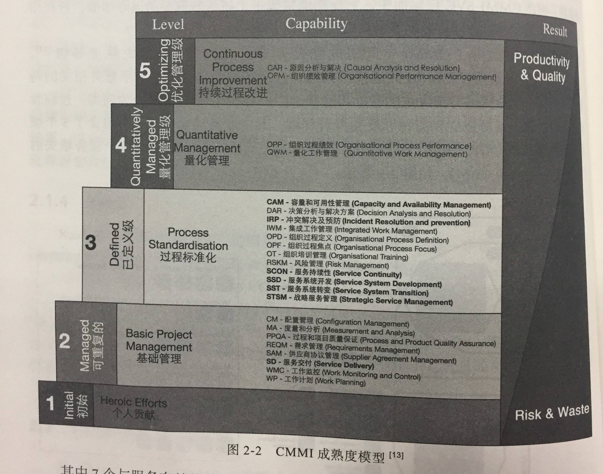
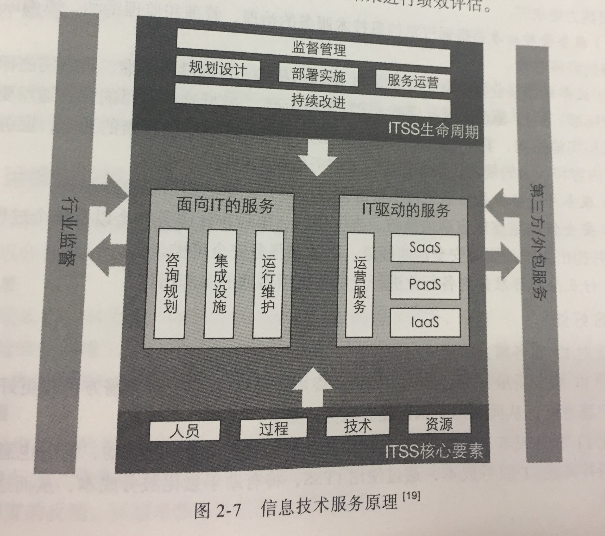
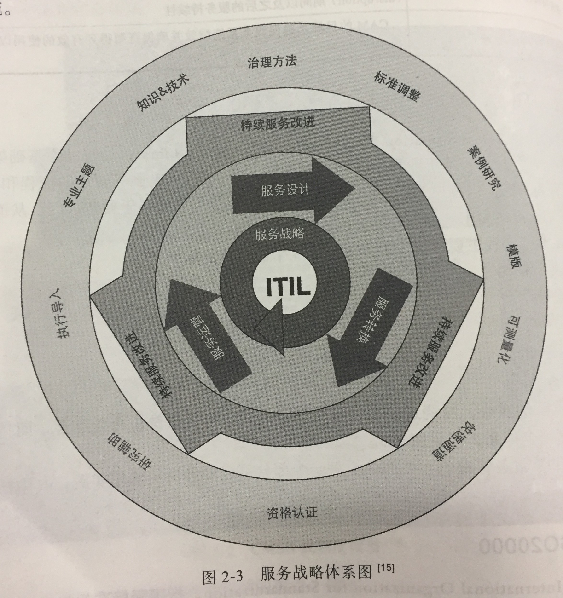
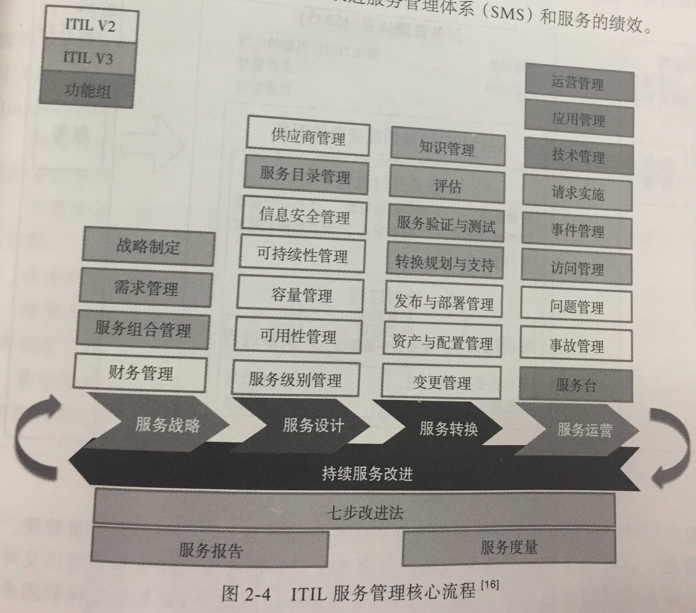
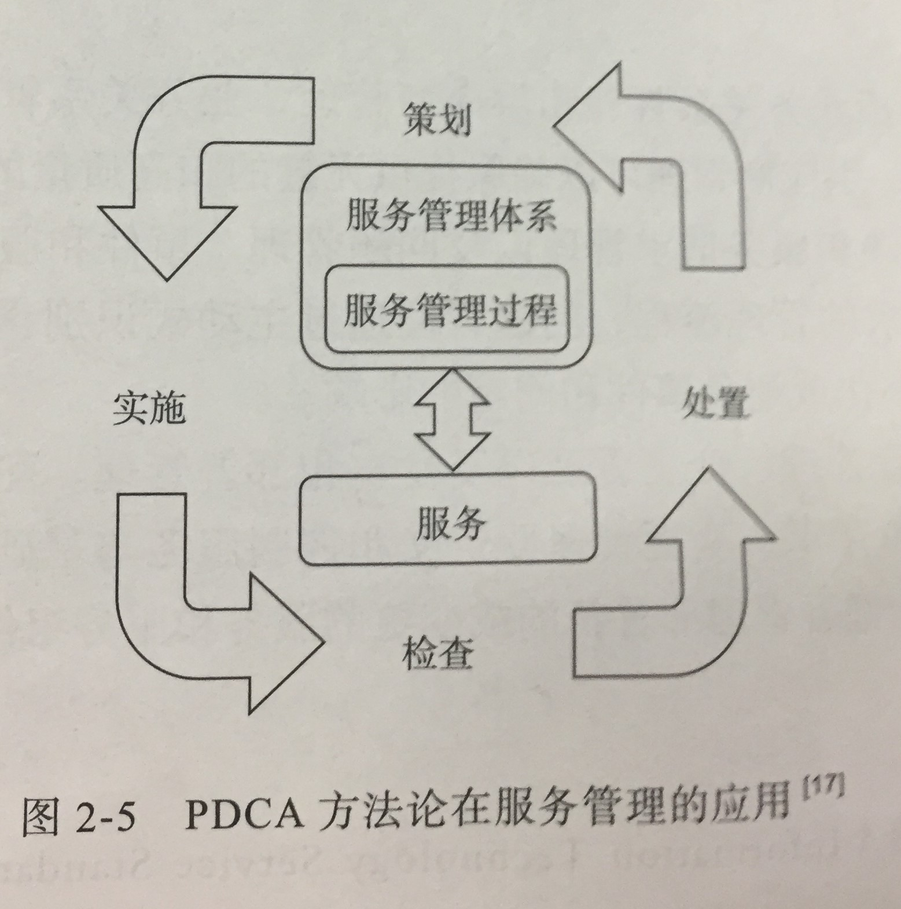
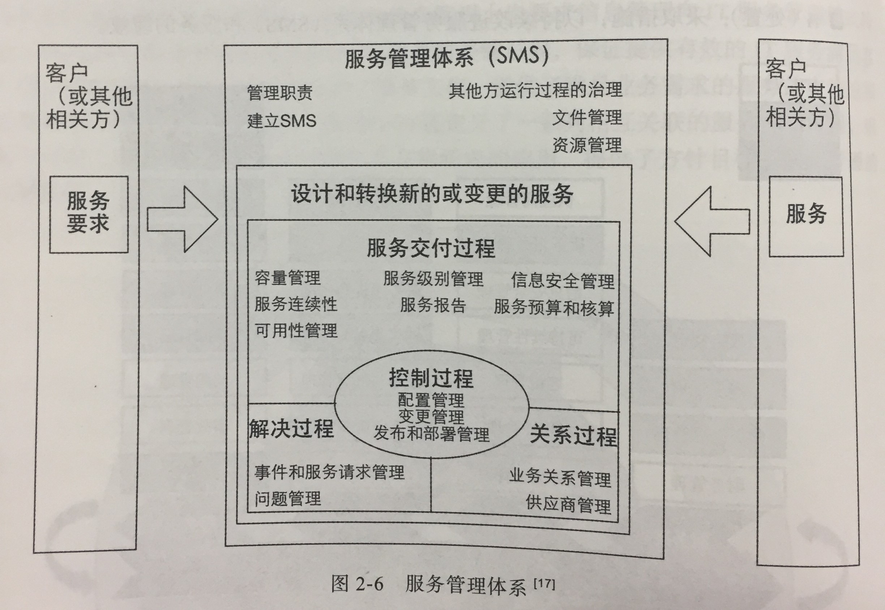
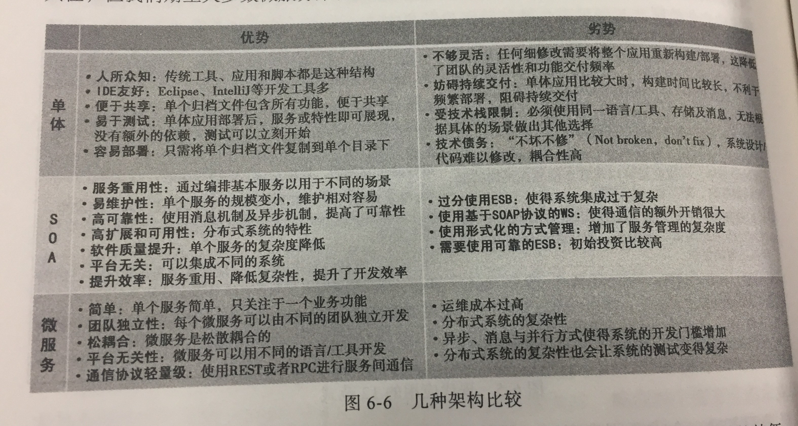
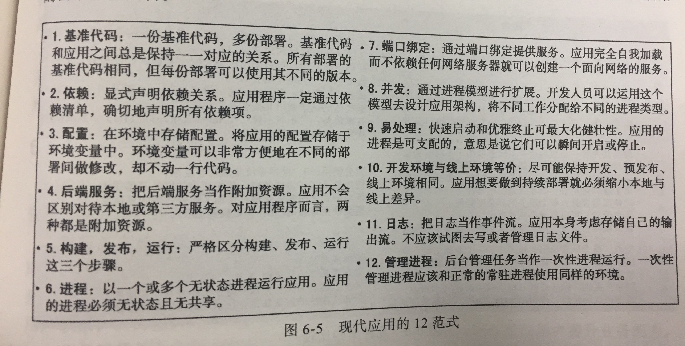
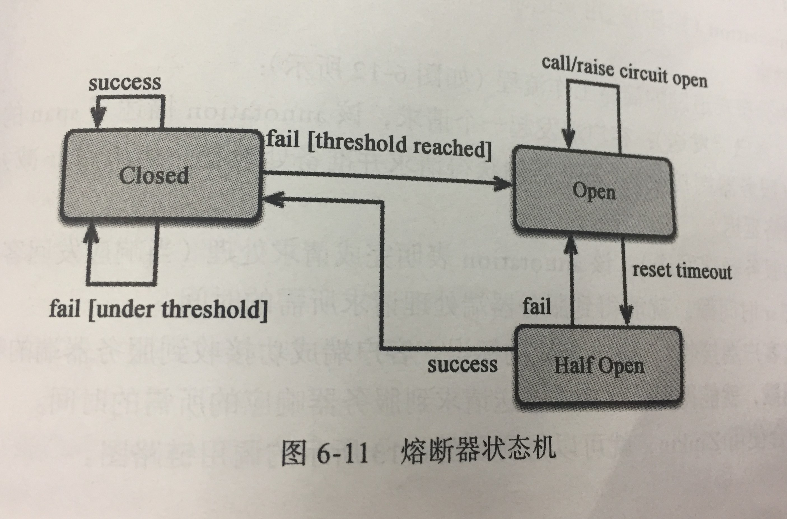

## 第二章
### 云计算
**定义**：云计算是一种允许通过网络随时随地便捷地按需使用可配置的计算资源共享池的模式，并且只需要投入很少的管理工作或与服务供应商进行很少的交互就能够快速地提供或释放这些计算资源，具有按需自服务、广泛的网络终端支持、资源池、快速弹性、可度量的服务等五大关键特点。
**分类**：
- 按服务模式
    - SaaS:软件即服务、PaaS:平台即服务、IaaS:基础设施即服务
- 按部署模式
    - 私有云、社区（行业）云、公有云、混合云
### ***思考题***
1. 云计算的大行其道对传统运维人员提出了新的要求，传统运维人员应该做哪些改变才能从容应对？
    - 实现自动化部署应用
    - 快速创建和复制资源模板
    - 动态扩容或缩小系统部署
    - 实时监控程序状态
    - 适应不同平台的差异
2. 云时代的运维与业界推崇的devOps有何联系？在互联网严峻的安全形势下，DevOps过程该如何考虑信息安全的问题呢？
    - devOps是云时代运维发展的一种趋势，自动化运维是云时代运维的发展方向，devOps是自动化运维的典型方法（这个是看书+上网以后 瞎猜的）
    - DevOps考虑信息安全（这个从网上找的，来自《the devOps Handbook》，权当参考，瞟一眼就好）
        - 将安全融入到开发迭代演示中
        - 确保安全工作包含于开发和运营的工作追踪系统中
        - 将信息安全整合到事后剖析过程中
        - 将预防性安全控制整合到共享源代码库和共享服务中
        - 将安全整合到部署流水线中
        - 保护部署流水线免受恶意代码影响
        - 保护应用程序安全
        - 保护软件供应链的安全
        - 保护环境的安全
        - 将信息安全整合到生产测量中
3. 请描述CMMI模型的要点
    - CMMI：(Capability Maturity Model Integration)能力成熟度模型集成
    - CMMI-SVC：(CMMI for Services服务模型)
    - 五个成熟度等级
        1. 初始级：个人贡献
        2. 可重复级：基础管理
        3. 已定义级：过程标准化
        4. 量化管理级：量化管理
        5. 优化管理级：持续过程改进
    - 四类过程域:
        - 过程管理、项目管理、服务建立和交付、支持过程域
    - 7个与服务有关的特定过程域
        - 服务交付(SD)、战略服务管理（STSM、冲突解决与预防（IRP）、服务系统转变（SST）、服务系统开发(SSD)、服务持续性（SCON）、容量和可用性管理（CAM）
    - CMMI成熟度模型
    
4. 请描述ITSS模型的要点
    - ITSS：Information Technology Service Standard 信息技术服务标准
    - 是一套成体系和综合配套的信息技术服务标准库，全面规范了信息技术服务产品及其组成要素，用于指导实施标准化和可信赖的信息技术服务，以保障其可信赖。
    - ITSS（IT服务）的生命周期——PIOIS
        - 规划设计（Planning & Design）
        - 部署实施（Implementing）
        - 服务运营（Operation）
        - 持续改进（Improvement）
        - 监督管理（Supervision）
        - 
    - ITSS核心要素——PPTR
        - 人员(People)、过程（Process)、技术（Technology）、资源（Resource）
    - ITSS的内容（6大标准）
        - 基础标准、服务管控标准、业务标准、服务外包标准、安全标准、行业应用标准
    - ITSS的好处（对服务需方/服务供方，三个方面）
        - 提升IT服务质量
        - 优化IT服务成本
        - 强化IT服务效能
        - 降低IT服务风险
5. 请描述ITIL模型的要点
    - ITIL：Information Technology Infrastructure Library(信息技术基础架构库)，是一套公开的、基于业界最佳实践制定的、用于规范IT服务管理的流程和方法论。以流程为导向，以客户为中心，目的是确保IT能更好地服务于业务部门，从而让企业的IT投资最大化
    - 围绕的五个部分（服务策略是核心）
        - 服务策略、服务设计、服务转换、服务运营、服务改进
    - 
    - 
6. 请描述ISO20000模型的要点
    - ISO: International Organization for Standardization 国际化标准组织
    - ISO20000帮助识别和管理IT服务的关键过程，提出了服务文化，定义了一系列相互关联的服务管理过程。
    - PDCA方法论
        - P（策划）：建立书面和协定的服务管理体系（SMS）,服务管理体系包括满足服务需求的方针、目标、计划和过程
        - D（实施）：实施和运行服务管理体系（SMS），以设计、转换、交付和改进服务
        - C（检查）：根据方针、目标、计划和服务需求，对服务管理体系（SMS）进行监视、测量和回顾，并报告结果
        - A（处置）：采取措施，以持续改进服务管理体系和服务绩效
        - 
    - 4个关键的服务管理过程
        - 服务交付过程：围绕IT服务管理的六个方面展开：容量管理、服务级别管理、信息安全管理、服务连续性、服务报告、服务预算和核算管理以及可用性管理
        - 关系过程：包括业务关系管理和供应商管理
        - 解决过程：包括事件和服务请求管理以及问题管理
        - 控制过程：包括配置管理、变更管理以及发布和部署管理
        - 

## 第六章

### ***思考题***

1. 什么是微服务架构？
    - 微服务架构风格是一种将一个单一应用程序开发为一组小型服务的方法，每个服务运行在自己的进程中，服务间通信采用轻量级通信机制（通常用HTTP资源API）。这些服务围绕业务能力构建，并且可通过全自动部署机制独立部署。这些服务共用一个最小型的集中式的管理，服务可用不同语言，使用不同的数据存储技术   
2. 比较微服务与单体应用架构、SOA架构的异同
    - 单体架构：应用程序的全部功能被一起打包作为单个单元或应用程序，部署在同一个JVM或同一台机器上
    - SOA架构：面向服务的体系结构，构造分布式计算的应用程序的方法，将应用程序功能作为服务发送给最终用户或其他服务。强调的是系统服务化和系统之间用良好定义的借口进行交互
    - 课本上的优劣比较
    

3. 什么是12范式？
    - 
4. 微服务架构的特征有哪些？
    - 通过服务组件化
    - 围绕业务能力组织
    - 是产品不是项目
    - 智能端口和哑通道
    - 去中心化治理
    - 去中心化数据管理
    - 基础设施自动化
    - 为失效设计
    - 进化式设计
5. 微服务的核心模式有哪些？
    - 服务注册与发现：服务提供者、服务消费者和服务发现组件
    - 配置中心
    - API网关
        - 优势：
            - 客户端无法察觉应用程序是如何被拆分成多项微服务的
            - 客户端不受服务实例的位置的影响
            - 为每套客户端提供最优API
            - 降低请求/往返次数
            - 将从客户端调用多项服务的逻辑转换为从API网关处调用，从而简化整个客户端
    - 熔断器
        - 状态：闭合状态、断开状态、半断开状态
        - 
    - 分布式追踪
    

